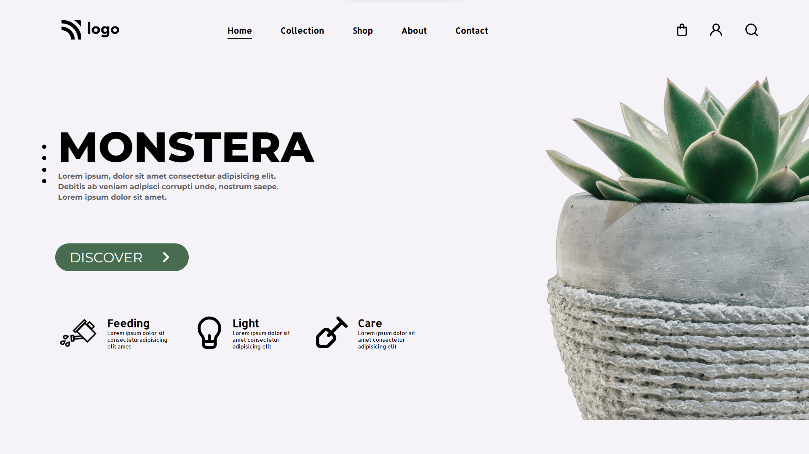

# Monstera landing page

My name is Shivam Sharma, and this is the fifth project and it is landing page of crypto startup.

 Time taken to complete this project is around **2 hrs**

**Key learning :** 

- Learned more about pseudo selectors like : ::before, ::after
- Different types of units of height and width
- Pseudo selectors like: first-child()
- I was struggling to place circles on the left side but fixed it using a pseudo selector and using properties like top and left to place those circles.

**Technology Used :**

**Deployed On :** 

## Screenshots

## 🔗 Links

